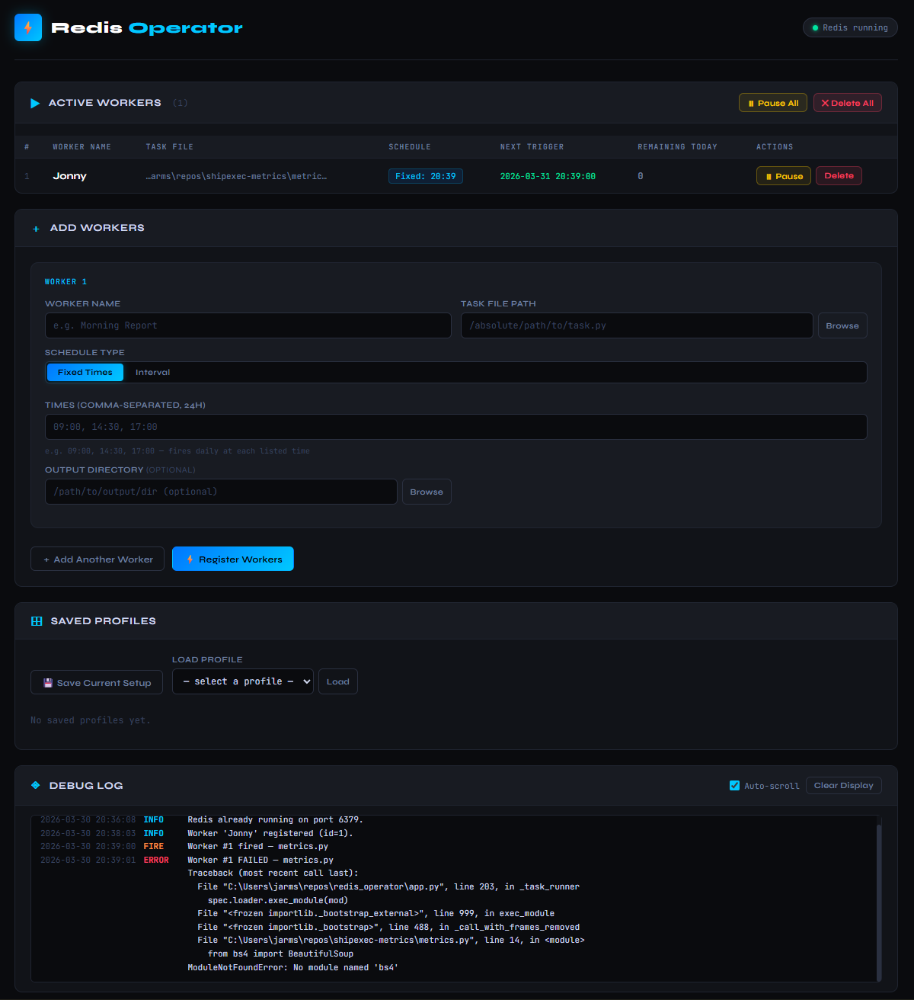

# Redis Operator

A local web dashboard for managing scheduled Python and batch workers via Redis + APScheduler. Register tasks, set schedules, and monitor everything from the browser — no terminal needed after launch.



## Features

- **Active Workers Panel** — live table of all running workers with next trigger time and remaining runs today. Pause/resume or delete individual workers, or bulk pause/delete all at once.
- **Flexible Scheduling** — Fixed Times (e.g. `09:00, 14:30, 17:00` — fires daily at each listed time) or Interval (e.g. `2h 30m` — repeats on a loop).
- **Task Support** — Python files (`.py` with a `run()` function), batch files (`.bat`, `.cmd`), and shell scripts (`.sh`).
- **Native File Picker** — OS-native file/directory browser via tkinter. No need to type paths manually.
- **Saved Profiles** — save and load named worker configurations. Switch between setups instantly.
- **Debug Log** — live scrolling log panel with color-coded entries (INFO, OK, FIRE, ERROR, PAUSE, DELETE). Auto-scroll toggle and clear display.
- **Redis Auto-Start** — detects whether Redis is already running; starts it automatically if not.
- **Persistent State** — all workers and profiles stored in SQLite. Workers automatically restore on restart via APScheduler's SQLAlchemy job store.

## Requirements

- Python 3.10+
- Redis server installed and on PATH

### Installing Redis

**Windows:**
```
winget install Redis.Redis
```
Or download from: https://github.com/tporadowski/redis/releases

**macOS:**
```
brew install redis
```

**Ubuntu/Debian:**
```
sudo apt install redis-server
```

## Setup

```bash
git clone https://github.com/jarmstrong158/redis-operator.git
cd redis-operator
pip install -r requirements.txt
```

## Usage

```bash
python launch.py
```

The dashboard opens automatically in your default browser at [http://127.0.0.1:5000](http://127.0.0.1:5000).
Press `Ctrl+C` to stop everything cleanly.

## Task File Format

### Python (`.py`)

Must have a module-level `run()` function with no parameters:

```python
def run():
    print("Task executed!")
```

### Batch / Shell (`.bat`, `.sh`, `.cmd`)

Executed as a subprocess. The worker's output directory (if set) is used as the working directory.

## Architecture

```
redis_operator/
├── launch.py              # Entry point — starts Flask, opens browser
├── app.py                 # Flask backend + APScheduler + SQLite + Redis
├── static/
│   └── index.html         # Entire frontend — HTML + CSS + JS (no frameworks)
├── tasks/
│   └── example_task.py    # Sample task with run() function
├── requirements.txt       # Python dependencies
└── redis_operator.db      # Auto-created SQLite database (gitignored)
```

| Layer | Detail |
|---|---|
| Backend | Python 3, Flask |
| Scheduling | APScheduler — BackgroundScheduler with SQLAlchemy job store |
| Persistence | SQLite (workers, profiles, job state) |
| Worker State | Redis (port 6379, auto-started if needed) |
| Frontend | Vanilla JS, no build step, single HTML file |

## AI Error Analysis

The debug log panel includes an **Analyze Errors** button that becomes active when ERROR-level entries are present. Clicking it sends those errors to Claude and displays a plain-English diagnosis and recommended fix directly in the dashboard.

### Setup

The feature requires an Anthropic API key. You have two options:

**Option A — prompted in the UI:**
Click "Analyze Errors" when no key is configured. A modal will ask for your key and save it to a local `.env` file automatically. The key is loaded on every subsequent launch.

**Option B — set it manually:**
Create a `.env` file in the project directory:
```
ANTHROPIC_API_KEY=sk-ant-...
```

The `.env` file is gitignored and your key is never transmitted anywhere except directly to the Anthropic API.

## API

| Method | Path | Purpose |
|---|---|---|
| `GET` | `/api/workers` | List all workers |
| `POST` | `/api/workers` | Register worker(s) |
| `POST` | `/api/workers/<id>/pause` | Toggle pause/resume |
| `DELETE` | `/api/workers/<id>` | Delete worker |
| `POST` | `/api/workers/pause-all` | Pause all workers |
| `DELETE` | `/api/workers/all` | Delete all workers |
| `GET` | `/api/profiles` | List saved profiles |
| `POST` | `/api/profiles` | Save profile |
| `GET` | `/api/profiles/<id>` | Load profile |
| `DELETE` | `/api/profiles/<id>` | Delete profile |
| `GET` | `/api/logs?since=N` | Log entries since offset N |
| `GET` | `/api/redis-status` | Redis connection status |
| `GET` | `/api/browse?mode=file\|dir` | Native OS file picker |

## License

MIT
